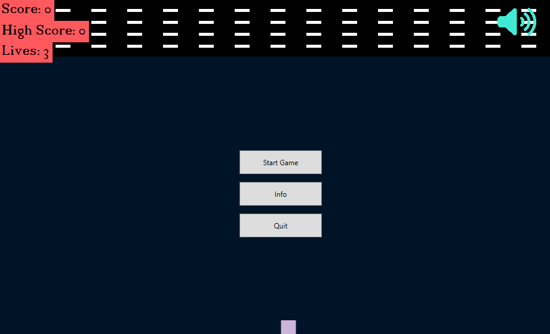
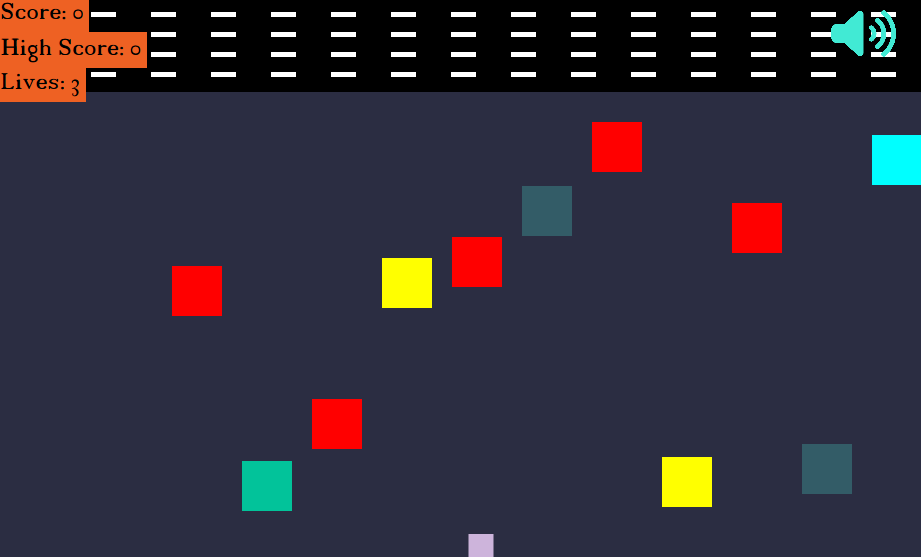

# Cube-Climber
Created game in WPF on similar way to crossy road. I have rewritten [this version](https://github.com/Fearplay/cross-the-road-python) in C# to publish it to the microsoft store.

## Index
- [Get the app](#get-the-app)
- [Screenshot](#screenshot)
- [General](#general)
- [Game Features](#game-features)
- [Usage](#usage)
- [Resources](#resources)
- [Other](#other)

## Get the app
- [Microsoft Store](https://www.microsoft.com/en-us/p/cube-climber/9pf41r70pph5?activetab=pivot:overviewtab)

## Screenshots

## General
 * You're trying to get your player [**small square**] to the finish line, which is all the way up. 
 * Meanwhile, the enemy [**big square**] is coming from the right. Every time you touch the finish line, you get one more point. 
 * The game ends when you touch an enemy 3 times

## Game Features 
 1. Whenever the score is divisible by 5 until the score reaches 45
  - Enemy speed **increases**
 2. Achieving a score between 16 and 29 
  - Spawning enemies is **greater**
  - You **can't use** (<kbd>A</kbd> or <kbd>&larr;</kbd>) and (<kbd>D</kbd> or <kbd>&rarr;</kbd>)
 3. Achieving a score **greater** than 29
  - Maximum number of spawning enemies
  - You **can't use** (<kbd>A</kbd> or <kbd>&larr;</kbd>) and (<kbd>D</kbd> or <kbd>&rarr;</kbd>)
 4. Change random colors of **player**, **screen**, **enemies** and **fonts**
 5. Change random **background music**
 6. To mute the background music, press the <kbd>M</kbd>

## Usage 
| MOVE | MAIN BUTTON | SECOND BUTTON |
| :---         |     :---:      |          :---:    |
| **up**       |<kbd>W</kbd>    |<kbd>&uarr;</kbd> |
| **left**     |<kbd>A</kbd>   |<kbd>&larr;</kbd>  |
| **down**     |<kbd>S</kbd>   |<kbd>&darr;</kbd>  |
| **right**    |<kbd>D</kbd>   |<kbd>&rarr;</kbd>  |

## Resources
 1. Background music
  - I used [Chrome Music Lab](https://musiclab.chromeexperiments.com/Song-Maker/)
 2. Sounds
  - I used [Leshy SFMaker](https://www.leshylabs.com/apps/sfMaker/)

## Other
* If you find any issue, please don't hesitate to report it via [Issues](https://github.com/Fearplay/Cube-Climber/issues)
* If you have an idea to improve this game, please don't hesitate to create pull request via [Pull requests](https://github.com/Fearplay/Cube-Climber/pulls)
* Thanks to all :green_heart:

[Back to TOP](#cube-climber)